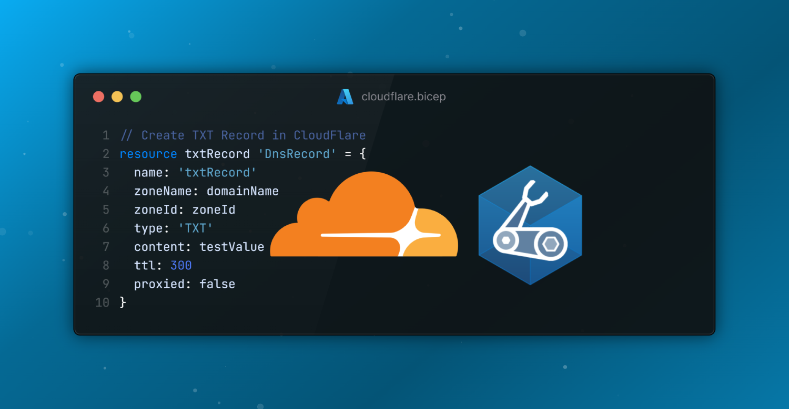
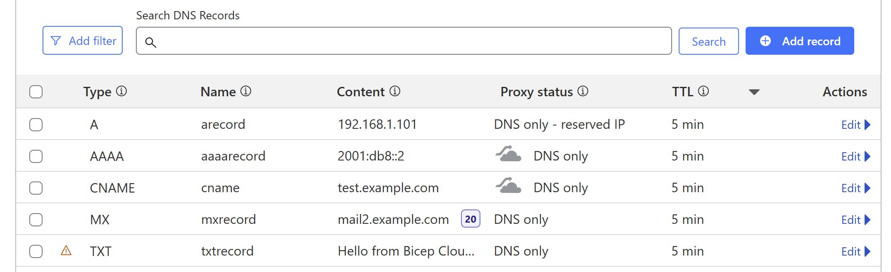

# Cloudflare Bicep Extension (Experimental)

A custom Azure Bicep extension for creating Cloudflare DNS resources through Infrastructure as Code (IaC). [Check this out to learn how to create your own .NET Bicep extension](https://techcommunity.microsoft.com/blog/azuregovernanceandmanagementblog/create-your-own-bicep-local-extension-using-net/4439967)




## 🚀 Overview

This project provides a Bicep extension that enables you to create Cloudflare DNS records and security rules directly from your Azure Bicep templates.

> [!NOTE]
> This is an experimental Bicep feature and is subject to change. Do not use it in production.

## ⚡ Current Capabilities

Experimental / sample only. Limited functionality to:

- Create Cloudflare DNS Records (A, AAAA, CNAME, MX, TXT, SRV, PTR, NS, CAA)
- Manage DNS record properties (content, TTL, proxied status)
- Support for multiple Cloudflare zones
- Apply Cloudflare Security Rules (Security Rules API)
- Idempotent updates when running `bicep local-deploy` multiple times (DNS records and security rules are updated in place)
- Free Plan only currently

See [`Sample/dns.bicep`](Sample/dns.bicep) and [`Sample/security-rule.bicep`](Sample/security-rule.bicep) for reference templates.

## 🚀 Getting Started

### Prerequisites

- [.NET 9.0 SDK](https://dotnet.microsoft.com/download/dotnet/9.0)
- [Bicep CLI](https://docs.microsoft.com/en-us/azure/azure-resource-manager/bicep/install)

### Cloudflare API Setup

You will need to create a Cloudflare API token from the [Cloudflare API Tokens page](https://dash.cloudflare.com/profile/api-tokens).

- Create Custom Token
- Permissions:
  - Zone - DNS - Edit (DNS records)
  - Zone - Firewall Services - Edit (security rules)
- Zone Resources: Include - Specific Zone - Your Domain
- Save and make a note of the API Token
- Make this an enviornment variable `CLOUDFLARE_API_TOKEN` locally (`$env:CLOUDFLARE_API_TOKEN = "here"`), or as a GitHub enviornment secret if running in a pipeline so that `bicep local-deploy` will authenticate successfully.

## 📋 Bicep Usage Example

```bicep
targetScope = 'local'
extension CloudFlare

@description('Cloudflare Zone ID for the domain')
param zoneId string

// DNS record sample
resource txtRecord 'DnsRecord' = {
  name: 'txtRecord'
  zoneName: 'example.com'
  zoneId: zoneId
  type: 'TXT'
  content: 'hello'
  ttl: 300
  proxied: false
}
```

```bicep
// Security rule sample
resource blockCountryTraffic 'SecurityRule' = {
  name: 'blockCountryTraffic'
  zoneId: zoneId
  description: 'Block traffic from CN'
  expression: '(ip.src.country eq "CN")'
  action: 'block'
  enabled: true
  reference: 'block-country-cn' // Unique ref 
}

output recordName string = txtRecord.name
output securityRuleId string = blockCountryTraffic.ruleId
...
```

> [!NOTE]
> The `SecurityRule` resource maps to the Cloudflare [Security Rules](https://developers.cloudflare.com/security/rules/) API and supports the free plan feature set.
> Specify the optional `reference` property when you need a custom Cloudflare identifier; the extension otherwise defaults it to the resource name on first deploy.

For comprehensive usage examples, please refer to the [`Sample/`](Sample/) directory in this repository.

## Local Development or Azure Container Registry

Here are the steps to run it either locally or using an ACR.

### Local build

Run script `Publish-Extension.ps1` from the folder [Infra/Scripts/](Infra/Scripts) to publish the project and to publish the extension locally for Bicep to use:

```powershell
./Infra/Scripts/Publish-Extension.ps1 -Target ./cloudflare-extension
```

This creates the binary that contains the Cloudflare API calls. Prepare your `bicepconfig.json` to refer to the binary. Set `experimentalFeaturesEnabled` -> `localDeploy` to `true` and refer to the extension `cloudflare` to the binary:

```json
{
  "experimentalFeaturesEnabled": {
    "localDeploy": true
  },
  "extensions": {
    "CloudFlare": "../bin/cloudflare" // local
  },
  "implicitExtensions": []
}
```

Run `bicep local-deploy Sample/dns.bicep --parameters zoneId='<your-zone-id>'` or `bicep local-deploy Sample/security-rule.bicep --parameters zoneId='<your-zone-id>' securityRuleExpression='(ip.src.country eq "CN")'` to test the extension locally. Also, see the examples in the [Sample](Sample/) folder.

### Azure Container Registry build

If you want to make use of an Azure Container Registry then I would recommend to fork the project, and run the GitHub Actions. Or, run the [Bicep template](Infra/main.bicep) for the ACR deployment locally and then push it using the same principal:

```powershell
[string] $target = "br:<registry-name>.azurecr.io/cloudflare:<version>"

./Infra/Scripts/Publish-Extension.ps1 -Target $target
```

In the `bicepconfig.json` you refer to the ACR:

```json
{
  "experimentalFeaturesEnabled": {
    "localDeploy": true
  },
  "extensions": {
      "CloudFlare": "br:cloudflarebicep.azurecr.io/cloudflare:0.1.25" // ACR
    // "CloudFlare": "../bin/cloudflare" // local
  },
  "implicitExtensions": []
}
```

### Public ACR

If you want to try it out without effort, then you can use `br:cloudflarebicep.azurecr.io/extensions/cloudflare:0.1.25` as the ACR reference which I have published.

## 🤝 Contributing

We welcome contributions to the Cloudflare Bicep Extension! Please see our [Contributing Guide](CONTRIBUTING.md) for detailed information on how to contribute to this project.
